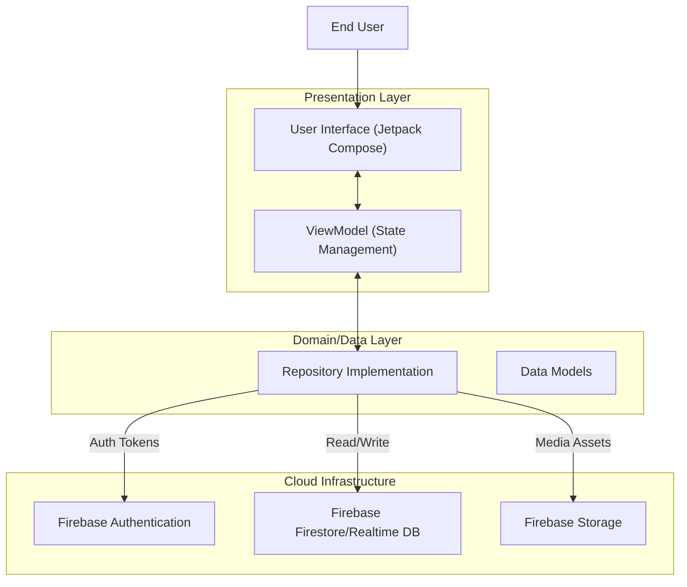

# Raki-Chatapp


> **Connect Instantly. Built with Modern Android Standards.**

[](https://kotlinlang.org)
[](https://developer.android.com)
[](https://firebase.google.com)
[](https://developer.android.com/jetpack/compose)
[](LICENSE)

---

## 📑 Table of Contents
- [Overview](#-overview)
- [Key Features](#-key-features)
- [Architecture & Design](#-architecture--design)
- [Tech Stack](#-tech-stack)
- [Project Structure](#-project-structure)
- [Getting Started](#-getting-started)
- [Roadmap](#-roadmap)
- [Contributing](#-contributing)
- [License](#-license)

---

## 🔭 Overview

**The Problem:** Building a real-time communication tool often involves complex backend infrastructure, websocket management, and boilerplate UI code that detracts from the user experience.

**The Solution:** **Raki-Chatapp** is a native Android application engineered to demonstrate a streamlined, serverless approach to messaging. By leveraging **Kotlin** and **Jetpack Compose** for a reactive UI, and **Firebase** for real-time data synchronization, Raki provides a seamless chat experience with minimal latency and high reliability.

---

## 🚀 Key Features

*   **🔐 Secure Authentication**: Robust Login and Signup flows powered by Firebase Auth.
*   **💬 Real-time Messaging**: Instant message delivery and synchronization across devices using Firestore/Realtime Database.
*   **🎨 Modern UI/UX**: Built entirely with **Jetpack Compose**, Android's modern toolkit for building native UI.
*   **📱 Responsive Layouts**: Optimized for various screen sizes and densities.
*   **👤 User Profiles**: Personalized profile management and user discovery.

---

## 🏗 Architecture & Design

Raki-Chatapp follows the **MVVM (Model-View-ViewModel)** architectural pattern combined with **Clean Architecture** principles. This ensures separation of concerns, testability, and scalability.

### System Architecture Diagram



### Data Flow
1.  **UI Layer**: Composable functions in `ui/chat` or `ui/login` observe state from ViewModels.
2.  **ViewModel**: Handles business logic and exposes `StateFlow` or `LiveData` to the UI.
3.  **Repository**: Abstracts the data sources. It decides whether to fetch data from a local database (Room - *future*) or the network (Firebase).
4.  **Firebase**: Acts as the Backend-as-a-Service (BaaS), handling identity and data persistence.

---

## 💻 Tech Stack

| Category | Technology | Description |
| :--- | :--- | :--- |
| **Language** | Kotlin | First-class language for Android development. |
| **UI Framework** | Jetpack Compose | Declarative UI toolkit. |
| **Backend** | Firebase | Auth, Firestore, and Storage. |
| **Build System** | Gradle (Kotlin DSL) | Dependency management and build automation. |
| **Asynchronous** | Coroutines & Flow | Handling background threads and data streams. |
| **Navigation** | Jetpack Navigation | Handling screen transitions. |

---

## 📂 Project Structure

The project is organized by **feature**, making it easy to navigate and scale.

```text
z_RaKi/MyApplication/
├── app/
│   ├── src/
│   │   ├── main/
│   │   │   ├── AndroidManifest.xml   # App configuration
│   │   │   ├── java/com/example/myapplication/
│   │   │   │   ├── MainActivity.kt   # Entry point
│   │   │   │   └── ui/               # Presentation Layer
│   │   │   │       ├── chat/         # Chat list & logic
│   │   │   │       ├── login/        # Authentication screens
│   │   │   │       ├── personal/     # Individual chat details
│   │   │   │       └── signup/       # Registration logic
│   │   │   └── res/                  # Static resources (images, themes)
│   ├── build.gradle.kts              # App-level build config
│   └── google-services.json          # Firebase configuration
├── build.gradle.kts                  # Project-level build config
└── settings.gradle.kts               # Module settings
```

---

## ⚡ Getting Started

### Prerequisites
*   **Android Studio** (Koala or newer recommended).
*   **JDK 17** or higher.
*   A **Firebase** project (optional if you want to use your own backend).

### Installation

1.  **Clone the repository**
    ```bash
    git clone https://github.com/rahulratho15/Raki-Chatapp.git
    cd Raki-Chatapp
    ```

2.  **Open in Android Studio**
    *   Select **File > Open**.
    *   Navigate to `Raki-Chatapp/z_RaKi/MyApplication` and select it.
    *   *Note: The actual project root is nested inside `z_RaKi`.*

3.  **Firebase Configuration**
    *   The project currently contains a `google-services.json` linked to a demo project (`my-application-a0a6a`).
    *   **Recommended:** Create your own project in the [Firebase Console](https://console.firebase.google.com/).
    *   Add an Android App with package name `com.example.RaKi`.
    *   Download your `google-services.json` and replace the existing one in `app/`.

4.  **Build and Run**
    *   Wait for Gradle sync to complete.
    *   Select an Emulator or physical device.
    *   Click the **Run** (▶️) button.

---

## 🔮 Roadmap

- [x] User Authentication (Login/Signup)
- [x] Real-time Chat Interface
- [ ] **Push Notifications** (FCM Integration)
- [ ] **Media Sharing** (Images/Audio)
- [ ] **Group Chats**
- [ ] **Dark Mode** Support
- [ ] **Offline Support** (Room Database Caching)

---

## 🤝 Contributing

Contributions are what make the open-source community such an amazing place to learn, inspire, and create. Any contributions you make are **greatly appreciated**.

1.  Fork the Project
2.  Create your Feature Branch (`git checkout -b feature/AmazingFeature`)
3.  Commit your Changes (`git commit -m 'Add some AmazingFeature'`)
4.  Push to the Branch (`git push origin feature/AmazingFeature`)
5.  Open a Pull Request

---

## 📄 License

Distributed under the MIT License. See `LICENSE` for more information.

---

<div align="center">
  <sub>Built with ❤️ by <a href="https://github.com/rahulratho15">Rahul Rathod</a></sub>
</div>
